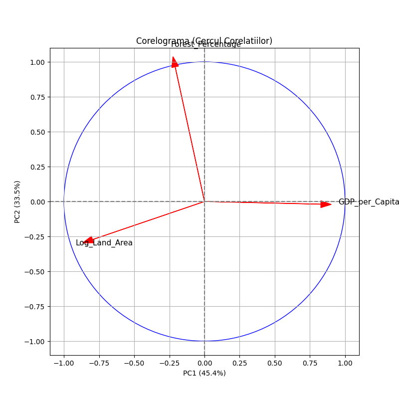

# Global Economic & Environmental PCA 🌍

## Overview
This project applies **Principal Component Analysis (PCA)** to explore the relationship between economic development and environmental resources across 200+ countries. Using 2023 data from the **World Bank**, the analysis investigates whether national wealth (GDP per Capita) is correlated with forest coverage.

## 📊 Key Findings
The analysis reduced the dataset dimensions while retaining **79% of the variance**.
- **PC1 (Economic/Size Axis):** Distinguishes between small, wealthy nations and large, developing ones.
- **PC2 (Ecological Axis):** Captures the gradient of forest coverage, showing that environmental preservation is relatively independent of economic status.

## 🛠️ Technologies Used
- **Python** (Pandas, NumPy)
- **Scikit-learn** (PCA, StandardScaler)
- **Matplotlib / Seaborn** (Data Visualization)

## 📂 Data Source
Data retrieved from [World Bank Open Data](https://data.worldbank.org/):
- GDP per capita (current US$)
- Forest area (sq. km)
- Land area (sq. km)

## 🚀 How to Run
1. Clone the repo
2. Install dependencies: `pip install pandas numpy matplotlib scikit-learn`
3. Run the script: `python main.py`
